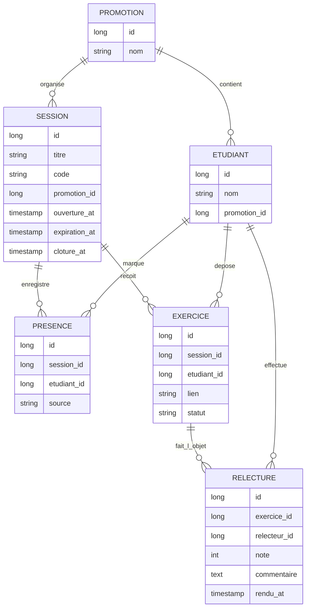

# D2 — Modèle de données (v2 après enveloppe)

Correspond aux migrations Flyway V1 + V2.

## Contraintes (v2)
presence(session_id, etudiant_id) : UNIQUE (RG2)

exercice(session_id, etudiant_id) : UNIQUE

relecture(exercice_id, relecteur_id) : UNIQUE — au plus un rendu par relecteur et par exercice. exercice_id n'est PLUS unique seul (v2).

relecture : jusqu'à 2 lignes par exercice (RG6 v2)

note : entier 0-20 (RG5)

source : ETUDIANT | FORMATEUR (RG11)

statut : DEPOSE | EN_ATTENTE | RELU
